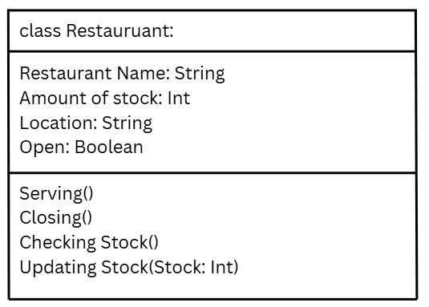

# SG4 - Understanding Classes and Objects
## Class Name
## Class Description
## Properties
| Property | Data Type | Description |
|Restaurant Name|String|What the name of the restaurant is.|
|Amount of stock|Int|How much stock the restaurant has.|
|Open|Boolean|Is the restaurant open or closed(Positive for open, Negative for closed).|
|Location|String|Where the restaurant is located.|

## Methods
| Method | Description |
|Serving|Serves the customers, and completes their order.|
|Closing|Multiplies the number by a negative, turning it closed or open.|
|Checking Stock|Shows info on the amount of stock left.|
|Updating Stock|Updates the amount of stock, adding or subtracting to the remaining stock|

## Class Diagram

## Design Explanation
### I chose this class because I was hungry when I decided to do this activity.
### The most important property for my class is “Available.” This is because it tells whether the store has closed down or is still open.
### The most important method is “Updating Stock.” This is because, if you weren’t able to update the stock amount, then you can’t serve anything. If you can’t serve enything, then you are not a restaurant.
